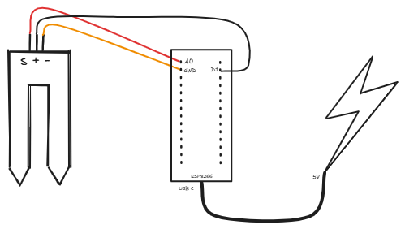

# Sensor de humedad

## Indice

- [Requisitos](#requisitos)
- [Diseño](#diseño)
- [Características](#características)
- [Instalación](#instalación) 

## Requisitos

- Sensor de humedad WPSE303
- Arduino ESP8266 NodeMCU
- Tres conectores hembra-hembra
- Fuente de alimentación de 5v

## Diseño



## Características

- El sistema se conecta automática a una red WiFi configurada en el código
- Se despliega un servidor web que muestra los datos del sensor de humedad en tiempo real (0-500).

```
GET /moisture 
{
    "moisture": 250
}
```

- Uso de un pin digital GPIO para encender y apagar el sensor. Esto permite que el sensor esté alimentado solo cuando se necesita, lo que ahorra energía y prolonga la vida útil del sensor.
- Uso de pin analógico para leer el sensor. El sensor devuelve un valor entre 0 y 500, donde 0 es el valor más seco y 500 el más húmedo.

## Instalación

1. Instala el Arduino IDE
   Puedes descargarlo desde: https://www.arduino.cc/en/software

2. Conecta el sensor a tu ESP8266 y éste por USB a tu ordenador. En el apartado diseño tienes el esquema de conexión

3. Configura el Arduino IDE para ESP8266

    - Abre el Arduino IDE
    - Ve a `Archivo` -> `Preferencias`
    - En la sección `Gestor de URLs Adicionales de Tarjetas`, añade la siguiente URL:
      ```
      http://arduino.esp8266.com/stable/package_esp8266com_index.json
      ```
    - Ve a `Herramientas` -> `Placa` -> `Gestor de Placas`
    - Busca `esp8266` e instala el paquete
    - Ve a `Herramientas` -> `Placa` y selecciona `NodeMCU 1.0 (ESP-12E Module)`
    - Ve a `Herramientas` -> `Puerto` y selecciona el puerto correspondiente a tu ESP8266 (aparecerá como COMx en Windows o /dev/ttyUSB0 o similar en Linux).
4. Inserta el código en Arduino IDE. Acuerdate de actualizar los valores de las variables `ssid` y `password` con los de tu red wifi.
5. Sube el programa al ESP8266
6. Abre el monitor serie en el IDE de Arduino y verifica que funciona correctamente.
7. Abre un navegador e introduce la dirección IP que aparece en el monitor serie. Deberías ver una página web con los datos del sensor de humedad.
8. Una vez verificado que funciona correctamente, puedes desconectar el ESP8266 del ordenador y alimentarlo con una fuente de alimentación de 5v. Puedes usar un cargador de móvil o una batería externa.
